# Monitorando uma rede 4g com Zabbix e Grafana

## Introdução
O presente artigo busca mostrar o passo a passo para instalação e configuração do monitoramento de rede via protocolo SNMP e Zabbix. Com estes conceitos explanados, ainda vamos abordar a ingestão de informação realizada pelo Grafana potencializando a capacidade de análise e aprimorando a experiência de monitoramento do usuário final. 

Para a viabilização do projeto foram disponibilizados elementos de rede de compõe uma infraestrutura completa de uma rede 4G que tem como rádio base uma Baicells, instalada e ativa em laboratório, acesso externo via pfsense, core Open 5gs e demais dispositivos que serão abordados com profundidade da seguinte sessão.   

### Topologia
Antes de começar a instalação do aplicativo de monitoramento da rede, se torna necessário verificar a conectividade dos dispositivos bem como analisar de que forma será feita a disposição dos dados de informação da rede. Para isso, o acesso inicial foi realizado via ssh a partir de um dispositivo conectado na rede do firewall pfSense para a máquina virtual alocada no servidor de virtualização proxmox na qual seria instalado o aplicativo de ingestão de dados para monitoramento. A partir daí foi possível confirmar o alcance a cada um dos dispositivos via utilitário **ping** e documentação fornecida ao grupo. Esta primeira análise permitiu a interpretação dos acessos disponíveis para recuperação das informações SNMP, culminando na seguinte topologia:
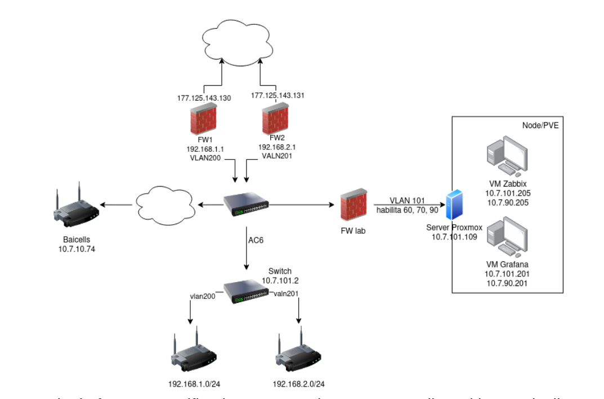
Dentre a topologia foram especificados para monitoramento os dispositivos Baicells, FW1, FW2, Switch PICA8, Server Proxmox e VM Grafana. Os diferentes dispositivos necessitam de diferentes abordagens para recuperação dos dados, uma vez que o sistema operacional varia e também a arquitetura de cada um deles. Foi preciso realizar uma análise de como a demanda de recuperação de informações seria abordada. Para isso foram analisados cada um dos dispositivos separadamente juntamente com a possibilidade de obter dados necessários para monitoramento. Sendo assim foram necessários definir abordagens de ingestão de dados via SNMP, agentes Zabbix, Plugin Zabbix e API. Para obter todos os dados e outras informações personalizadas foram realizadas mais de uma abordagem para um só dispositivo. Nesta etapa foi possível definir o plano de ataque ao cerne da demanda observando dispositivo por dispositivo conforme especificado a seguir.

|Dispositivo|Host|Zabbix|
|---|---|---|
|VM Grafana|10.7.101.201|Zabbix Agent|
|Server Proxmox|10.7.101.109|API via HTTP|
|Switch PICA8|10.7.101.2|Protocolo SNMP|
|pfSense FW1|IP-Público|Zabbix Agent + SNMP|
|pfSense FW2|IP-Público|Zabbix Agent + SNMP|
|Baicells|10.7.10.74|Protocolo SNMP|

### SNMP
O protocolo SNMP é responsável por transferir informações pela porta 161, via UPD respeitando uma estrutura padronizada com indexação pública ou privada. Os padrões de indexação são chamados de MIBs enquanto cada um dos elementos são OIDs. Essas marcações estipuladas possuem uma estrutura padrão definida na RFC 1213. Por padrão este protocolo é mais utilizado em dispositivos até a camada 3 como roteadores, switches e antenas. Isso permite uma consulta às informações dos dispositivos de forma remota.

### Zabbix Agent
O Agente Zabbix é um utilitário que pode ser instalado em inúmeras plataformas, ele conversa com o servidor através da porta 10050 por meio de conexão TCP e funciona como uma extensão do Zabbix. Em sua camada de aplicação ele usa um protocolo proprietário baseado em JSON e sua configuração depende da definição do IP do servidor e hostname. Um agente é comumente utilizado em endpoints da rede que já dispõe de sistema operacional e resolvem a camada 7.

### API
O uso da API vai depender da disponibilidade de uso das aplicações presentes na infraestrutura. No caso em questão a recuperação de dados dessa forma foi aplicado no servidor de máquinas virtuais Proxmox. A comunicação deste serviço de informação  é realizado via protocolo https, 443 através de uma conexão tcp. Sua configuração é realizada através de token para consumo das informações pelo servidor.

## Instalando e configurando o Zabbix
Depois de confirmar a conectividade do servidor com os elementos que serão monitorados e realizar uma análise sobre qual forma de coleta é melhor para cada um deles, obtemos como resultado um cenário a ser cumprido. Sendo assim, conforme já especificado na tabela 1 a topologia gráfica de rede ficará conforme a imagem 2.
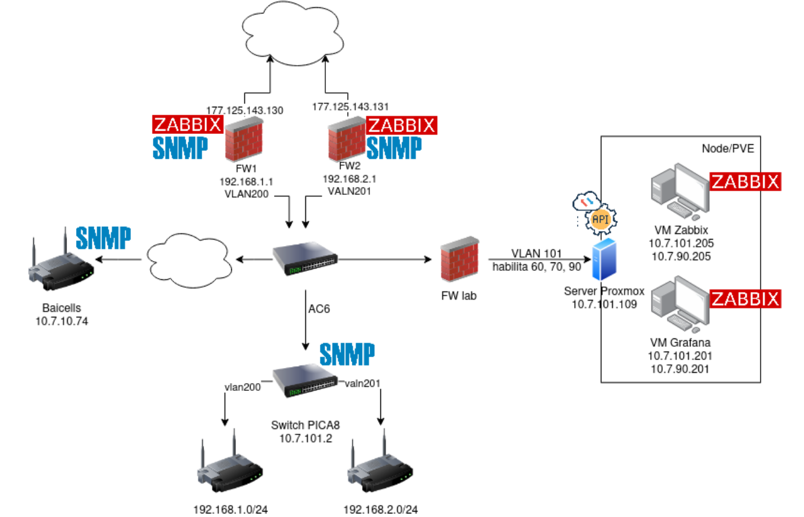
Uma vez estabelecidos os objetivos sobre a abordagem de monitoramento de cada dos elementos. É hora de iniciar a instalação e configuração em cada um deles.

### Preparação do ambiente 
Para seu funcionamento e acesso via interface http de administração, o aplicativo demanda a preparação do ambiente com a instalação e configuração de dependências de banco de dados e servidor web. 

O zabbix pode se adequar a inúmeras variações de soluções instaladas no ambiente. O ambiente em questão foi preparado em um Ubuntu 22 LTS (jammy), com servidor web Nginx e banco de dados MySQL. Ambos os utilitários já estão no repositório da distribuição unix based e podem ser instalados com o seguinte comando:
```
Sudo apt install nginx
Sudo apt install mysql-server
```
Em seguida pode-se verificar o funcionamento dos utilitários com o comando:
```
Sudo systemctl status nginx
Sudo systemctl status mysql-server
``` 
Uma vez instalados esses serviços e confirmando sua execução podemos partir para a instalação do Zabbix.

### Instalando Zabbix
O serviço de monitoramento tem uma completa documentação e oferece configurações personalizadas para cada ambiente conforme as variações de serviços rodando no servidor preparado para o zabbix. Ao acessar o site oficial na aba de downloads, foi escolhido pelo grupo os parâmetros destacados na imagem 3.
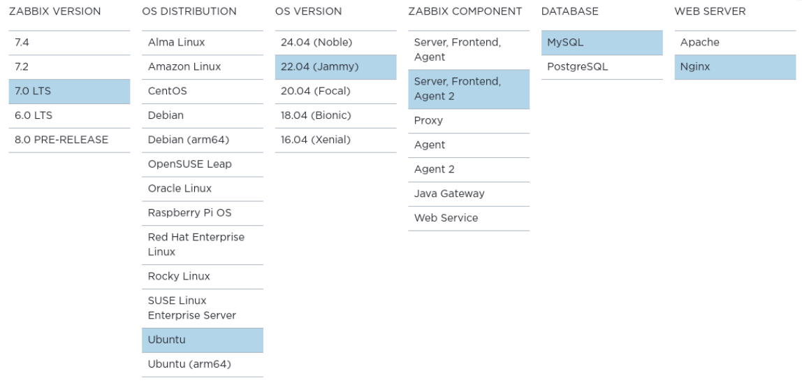
O primeiro comando a ser executado após definir as configurações de ambiente servem para instalar o repositório Zabbix na lista de repositórios padrões do sistema operacional Ubuntu. O comando wget realiza uma requisição de download de um pacote “.deb”, o utilitário dpkg instala o pacote no gerenciador de instalação. Por fim, o comando apt update atualiza a lista de pacotes do gerenciador.
```
wget https://repo.zabbix.com/zabbix/7.0/ubuntu/pool/main/z/zabbix-release/zabbix-release_latest_7.0+ubuntu22.04_all.deb
dpkg -i zabbix-release_latest_7.0+ubuntu22.04_all.deb
apt update 
```
No passo seguinte se instala os utilitários do zabbix que incluem o servidor mysql, o arquivo de configurações do nginx, o frontend em php e agente utilizado no servidor. O comando recomendado é o seguinte:
```
apt install zabbix-server-mysql zabbix-frontend-php zabbix-nginx-conf zabbix-sql-scripts zabbix-agent2
```
O próximo passo recomendado é instalar os plugins do agente 2 (agente escolhido para a estrutura do servidor). O comando para isso é o seguinte:
```
apt install zabbix-agent2-plugin-mongodb zabbix-agent2-plugin-mssql zabbix-agent2-plugin-postgresql
```
Os comandos servem para configurar o banco de dados no mysql instalado nos passos anteriores, criar um usuário para o zabbix, conceder privilégios ao aplicativo e habilitar função de criação e saída do mysql. 
```
Mysql -uroot
Set global log_bin_trust_function_creators = 0;
Create database zabbix character set utfmb4 collate utf8mb4_bin;
Create user zabbix@localhost identified by ‘defina a senha’;
Grant all privilages on zabbix.* to zabbix@localhost;
Set global log_bin_trust_ function_creators = 1;
quit
```
Em seguida, se recomenda utilizar o zcat concatenado com mysql para criar a estrutura inicial do banco de dados zabbix. 
```
zcat /usr/share/zabbix-sql-scripts/mysql/server.sql.gz | mysql --default-character-set=utf8mb4 -uzabbix -p zabbix
```
Por fim, se desabilita a função de criação no banco de dados seguindo a boas práticas de segurança.
```
Mysql -uroot
Set global log_bin_trust_function_creators = 0;
quit;
```
Após configurar o banco de dados é preciso realizar a edição do arquivo de configuração do zabbix localizado na path “/etc/zabbix/zabbix_server.conf” onde os seguintes parâmetros precisaram ser alterados.
```
DBPassword=’senha definida para o usuário zabbix no mysql’
DBSocket=/var/run/mysqld/mysqld.sock
``` 
Neste ponto a forma de consulta e a estrutura do banco de dados já estão preparados. Resta, no entanto, configurar o acesso pela interface web para administração do aplicativo. Isso deve ser feito com a inclusão do arquivo de configuração do servidor web para o diretório do nginx. No caso do ambiente em questão, isso foi realizado da seguinte forma:
```
Cp /usr/share/doc/zabbix-nginx-conf/examples/nginx.conf /etc/nginx/conf.d/zabbix.conf
```
Em seguida é preciso deletar a página padrão para evitar que o servidor exiba o arquivo de configuração padrão.
```
Rm /etc/nginx/conf.d/zabbix.conf
```
Seguindo as melhores práticas, para recarregar as configurações nos serviços alterados, ainda é recomendável reinicializar e habilitar a iniciação com máquina dos serviços com systemctl.
```
Systemctl restart zabbix-server zabbix-agent2 nginx php8.1-fpm
Systemctl restart zabbix-server zabbix-agent2 nginx php8.1-fpm
```
Se tudo tiver corrido bem o Zabbix estará acessível via navegador web pelo ip da máquina local. A primeira página vai solicitar o usuário e login que por padrão no primeiro acesso é Admin e zabbix. A tela inicial será correspondente a imagem 3.

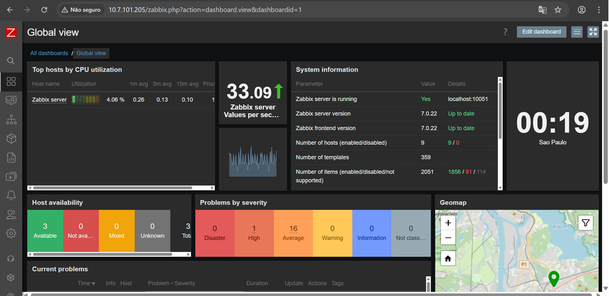
### Configurando Proxmox via API
Antes de iniciar a configuração da recuperação de informações via API no Proxmox é necessário configurar o sistema para que a MTU da nossa máquina virtual onde o zabbix está se limite a 1400, caso o contrário os pacotes serão perdidos e a comunicação não será fechada com host alvo. Para isso basta enviar o comando utilizando o utilitário ip.
```
Ip Link Set dev INTERFACE mtu 1400
```
Depois disso é necessário realizar uma requisição para criar um usuário para o zabbix no proxmox com permissões de pelo menos PVEAuditor e gerar um Token para que o mesmo consuma informações via API. Isso pode ser feito via linha de comando no cmd do Proxmox. No cluster pve, basta selecionar a opção shell e digitar os seguintes comandos.
```
pveum user add zabbix-monitor@pve --password SUA_SENHA_AQUI
pveum acl modify / --user zabbix-monitor@pve --roles PVEAuditor
pveum user token add zabbix-monitor@pve zabbix-token --privsep 0
``` 
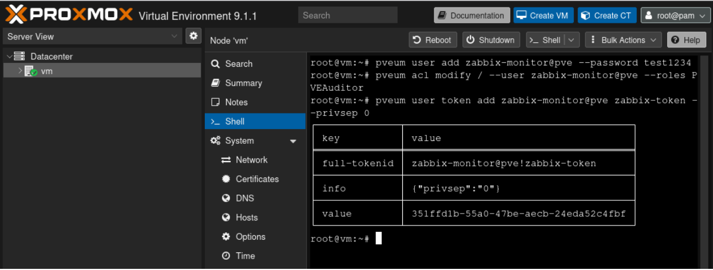
Conforme visto na imagem 4 o último comando gera um token que deverá ser copiado e informado nas configurações de host do Zabbix. Além disso, outros parâmetros devem ser informados. O caminho para criar um host no Zabbix se inicia pelo menu lateral esquerdo, na aba “Data Collection”, no canto superior direito “Create host”. Como pode ser visto na imagem 5 foram inseridos as seguintes informações.

**Host**
- Host name: 10.7.101.109
- Visible name: Server_Promox
- Templates: Proxmox VE by HTTP
- Host groups: Hypervisors
- 
**Macros**
- {$PVE.URL.HOST}:10.7.101.109
- {$PVE.URL.PORT}:8006
- {$PVE.API.TOKEN.SECRET}: XXXXXXXX-XXXX-XXXX-XXXX-XXXXXXXX
- {$PVE.NODE.NAME}: pve

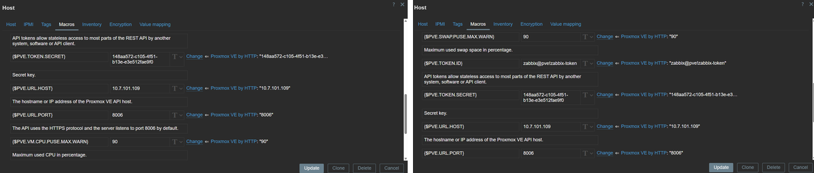
Algum tempo depois da inclusão do host os itens de pesquisa vão começando a aparecer. Depois dos dados carregados foi possível correlacionar os itens da MIB com a demanda de monitoramento do proxmox, tendo como resultado a tabela 2.

|DEMANDA|ITEM|
|--|--|
|Bits recebidos em todas as portas relevantes|Node [pve]: Incoming data, rate|
|Bits enviados em todas as portas relevantes|Node [pve]: Outgoing data, rate|
|Utilização da CPU|Node [pve]: CPU, usage|
|Utilização da Memória|Node [pve]: Memory, used|
|Quantidade de disco utilizado em porcentagem|100 * (proxmox.node.disk / proxmox.node.maxdisk)|

A maioria das regras já estavam disponíveis no template escolhido no momento da criação do host. No entanto, para chegar ao cálculo de porcentagem de uso de disco foi preciso criar um item que avaliava os resultados de outros dois itens para chegar ao dado tratado da forma esperada. Para isso na aba Data Collection, após selecionar a opção Itens do host Proxmox_Server, no canto superior direito haverá a opção Create Item. Os parâmetros foram passados conforme podem ser vistos na imagem 6.
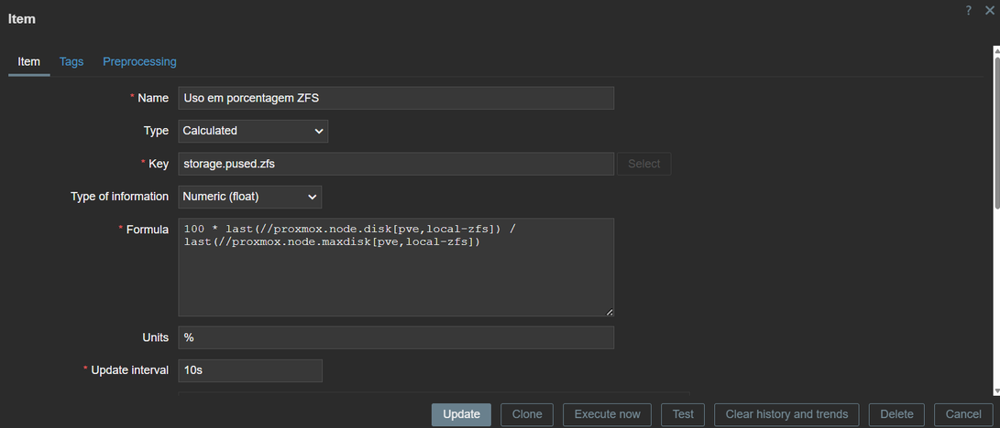
No zabbix é possível criar alguns dashboards para verificar os dados de forma mais amigável, porém de forma menos dinâmica que o grafana que será abordado mais adiante neste relatório. Por hora essa opção serviu para separar os itens encontrados e dispor os dados em gráficos para conferir a veracidade da informação recebida. O resultado deste gráfico prévio pode ser visto na imagem 7.
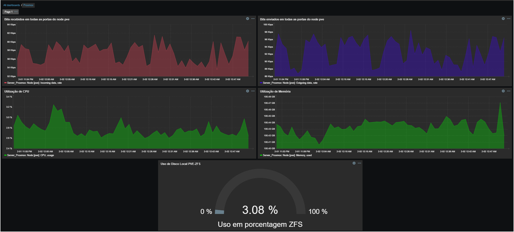

### Configurando PfSense via Snmp e Agente
O Pfsense tem uma característica interessante na qual permite que zabbix recupere dados tanto pelo Agente que é instalado via plugin na interface de administração web, quanto por SNMP que pode ser habilitado no mesmo lugar. Para habilitar este último, no menu principal da interface é preciso ir na aba Services, SNMP, definir o campo Polling Port com o valor 161 e o campo Read Comunity String com um valor privado. A caixa Enable também deve estar ativada bem como os SNMP Modules. Feito isso basta salvar e reiniciar o serviço no botão localizado no canto superior direito que pode ser visto na imagem 8.
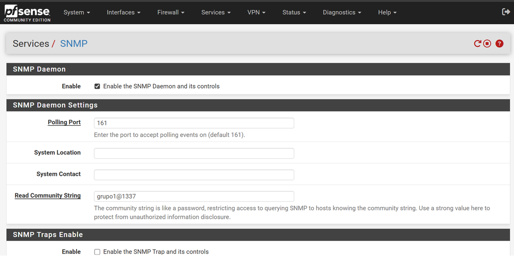
A configuração do agente segue um caminho muito parecido com o passo anterior, mas dessa vez o plugin deve ser instalado via aba System, Packe Manager. No campo de pesquisa basta procurar pelo termo Zabbix. Como a versão do servidor utilizada pelo grupo foi a 7 o plugin escolhido foi o zabbix-agent7. Depois de instalado o agente estará na aba Services. Assim como o SNMP ele deve ser ativado, mas os parâmetros a serem informados aqui são os campos Server e Server Active conforme pode ser visto na figura 9.
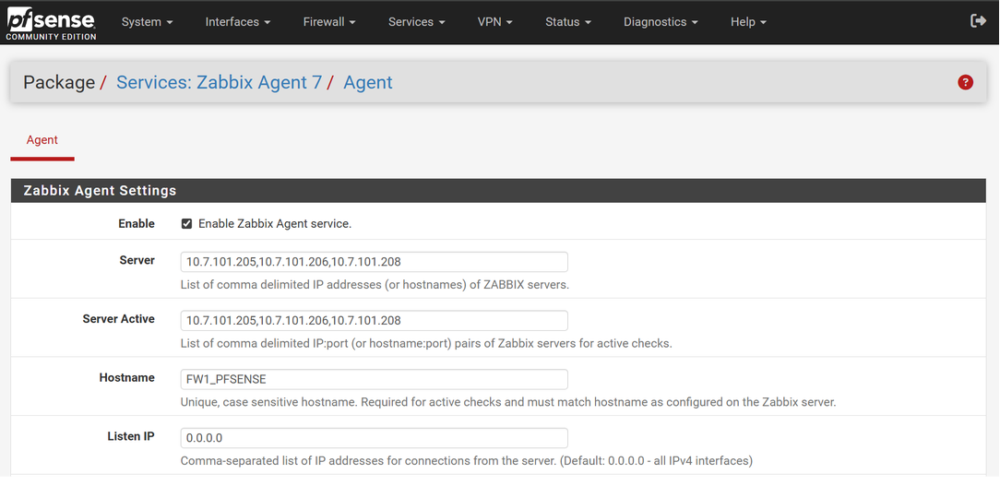
Depois de realizar estas configurações o PfSense está pronto para enviar dados ao servidor Zabbix. A criação do host segue o mesmo caminho que o passo anterior, com as informações de parâmetros diferentes explicitados na imagem 10.
**Host**
- Host name: 177.125.143.130
- Visible Name:  FW1_PFSENSE
- Templates: pfSense Active: OpenVPN Server User Auth, pfSense Active: Speedtest, PFSense by SNMP
- Host groups: Applications
- Interfaces: Agent e SNMP
**Macros**
{$SNMP_COMUNITY}: *****
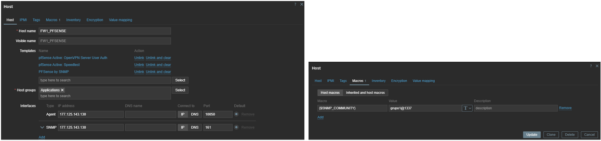
Com os templates adicionados e os dados carregados é preciso identificar qual item satisfaz as demandas de monitoramento dos hosts. Esta análise pode ser vista na tabela 3.

|DEMANDA|ITEM|
|--|--|
|Bits recebidos em todas as portas relevantes|FW1_PFSENSE: Interface [*()]: Bits received|
|Bits enviados em todas as interfaces|FW1_PFSENSE: Interface [*()]: Bits sent|
|Número de usuários de OpenVPN|OpenVPN: Total de usuários logados|

Os itens que verificam o tráfego nas interfaces já estavam disponíveis nos templates adicionados no momento da criação do host. Já para obter o total de usuários logados foi necessário utilizar um script personalizado. A solução foi encontrada no Github de Rbicelli e calculada em um novo item criado pelo grupo no Zabbix. 

Para obter os usuários logados via OpenVPN foi necessário criar um arquivo em php que realiza esta verificação na máquina do pfSense e chamá-lo como rotina na área de comandos personalizados do Plugin no pfSense. Pra isso, na interface web de administração gráfica do firewall, no utilitário de execução de comando que fica na aba Diagnostics com o nome Command Prompt deve-se executar a seguinte chamada.
```
curl --create-dirs -o /root/scripts/pfsense_zbx.php https://raw.githubusercontent.com/rbicelli/pfsense-zabbix-template/master/pfsense_zbx.php
```
O comando baixa diretamente do repositório Github o script .php e o salva na pasta scripts/root por meio do utilitário curl. Em seguida e ainda no pfSense é necessário acessar o painel de opções avançadas do plugin agent-zabbix7. No campo User Parameters, é necessário inserir os seguintes comandos.
```
AllowRoot=1
UserParameter=pfsense.states.max,grep "limit states" /tmp/rules.limits | cut -f4 -d ' '
UserParameter=pfsense.states.current,grep "current entries" /tmp/pfctl_si_out | tr -s ' ' | cut -f4 -d ' '
UserParameter=pfsense.mbuf.current,netstat -m | grep "mbuf clusters" | cut -f1 -d ' ' | cut -d '/' -f1
UserParameter=pfsense.mbuf.cache,netstat -m | grep "mbuf clusters" | cut -f1 -d ' ' | cut -d '/' -f2
UserParameter=pfsense.mbuf.max,netstat -m | grep "mbuf clusters" | cut -f1 -d ' ' | cut -d '/' -f4
UserParameter=pfsense.discovery[*],/usr/local/bin/php /root/scripts/pfsense_zbx.php discovery $1
UserParameter=pfsense.value[*],/usr/local/bin/php /root/scripts/pfsense_zbx.php $1 $2 $3
```
Por fim, é preciso inserir o template personalizado no host pfSense do zabbix. O template também é disponibilizado no repositório de rbicelli. Depois de baixado o mesmo deve ser importado para o Zabbix através da aba Data Collection, Templates. No canto superior direito haverá a opção Import. Basta selecionar o arquivo e em seguida no host pfsense adicionar o template a suas configurações. 

Isso resolve a coleta de dados de usuários logados no OpenVPN, mas não traz o número tratado. Para isso, novamente foi necessário criar um item específico que trate os parâmetros de usuários logos e os transforme em números de usuários ativos. Sendo assim as configurações deste item foram realizadas conforme disposto na imagem 11.

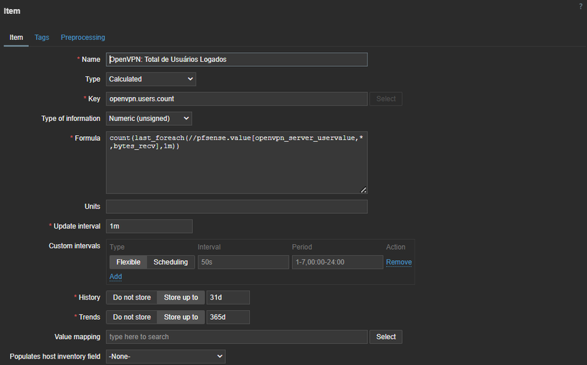
Com estas configurações os gráficos prévios dos pontos de monitoramento solicitados pode ser visto na imagem 12.
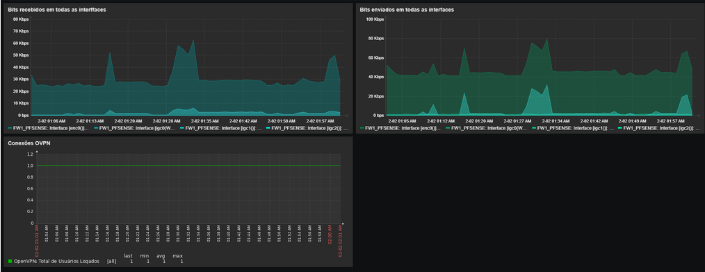

### Configurando Switch via SNMP
Como os demais dispositivos de rede o Switch possui a disponibilidade de recuperar informações via protocolo SNMP. Sendo assim, toda a comunicação de monitoramento foi realizada com MIBs e OIDs. Antes de criar o host, o mapeamento  das OIDs disponíveis para consulta pode ser feito via utilitário de linha comando snmpwalk. Ao enviar o comando apontando o host e informando a community, todas as informações serão retornadas no terminal conforme imagem 13.
```
Snmpwalk -v 2c -c public 10.7.101.2
```
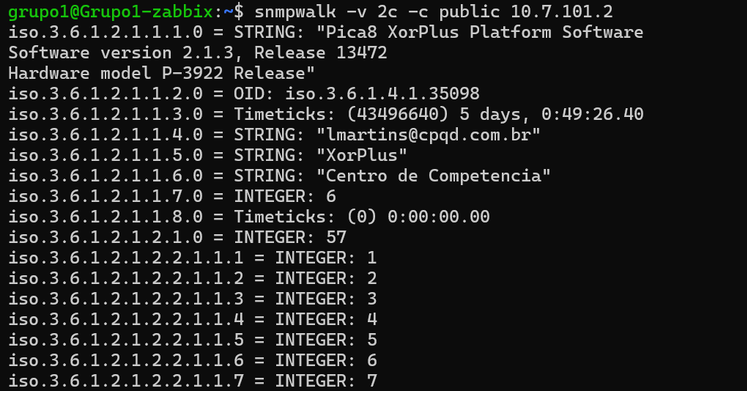
A resposta de todos os OIDs confirma que a community configurada é a public. Além disso, é possível verificar as informações de versão e modelo do dispositivo nas primeiras solicitações. Uma vez tendo verificado a funcionalidade do protocolo SNMP no dispositivo, o host pode ser criado no servidor Zabbix. Seguindo os mesmos passos dos elementos anteriores, os parâmetros modificados para o switch podem ser vistos na imagem 14 e foram passados da seguinte forma.

**Host**
- Host name: 10.7.101.2
- Visible Name: SWITCH_PICA8
- Templates: Cisco IOS by SNMP, PICOS Private MIB
- Host group: PICA
- Interfaces: SNMP
 
**Macros**
- {$SNMP_COMMUNITY}: public
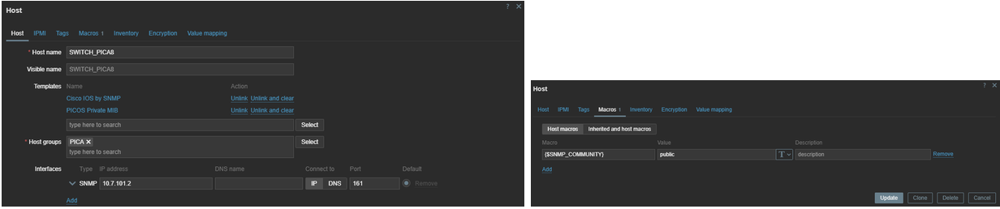
Os templates utilizados neste elemento se referem a dois modelos de Switch diferentes, mas que correspondem com algumas OIDs, por se tratar de Switches. O template Cisco vem instalado por padrão no utilitário Zabbix, enquanto o PICOS private foi preciso ser baixado nos repositórios oficiais da distribuição e importado para o servidor. Com os dois recebendo os dados devidos foi possível encontrar as informações de monitoramento solicitadas conforme mostrado na tabela 4.

|DEMANDA|ITEM|
|--|--|
Bits recebidos em todas as portas relevantes|SWITCH_PICA8: Interface *: Bits received|
|Bits enviados em todas as portas relevantes|SWITCH_PICA8: Interface *: Bits sent|
|Utilização da CPU|Utilização de CPU: 1.3.6.1.4.1.35098.1.1.0|
|Utilização de Memória|Memory.usage / total.memory * 100|

Os dados de utilização de memória e de utilização de CPU precisaram ser criados calculando o uso de memória e informando o OID da unidade. Já os itens que verificam o tráfego nas portas relevantes foram obtidos pela MIB Cisco. O processo de criação do item de porcentagem de uso da CPU foi realizado por meio de pesquisa e comparação com snmpwalk. Após encontrar o valor correto por meio de pesquisa e requisições com snmpwalk foi possível criar o item conforme exemplificado na imagem 15.
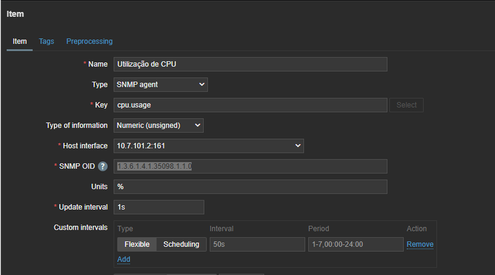
Sendo assim a dashboard prévia criada no Zabbix ficou conforme pode ser visto na imagem 16.
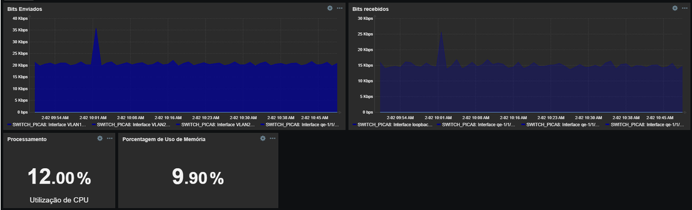
### Configurando Baicells via SNMP
A configuração da Baicells segue a mesma lógica do switch. Após identificada a community como public seus OIDs podem ser pesquisados via snmpwalk. Sendo assim a criação do host no Zabbix se baseou em apontar para o IP da Baicells conforme imagem 16 e com as seguintes informações.

**Host**
- Host name: 10.7.10.74
- Visible name: eNodeb_Baicells
- Templates: Linux by SNMP
- Host groups: Discovered hosts
- Interfaces: SNMP

**Macros**
- {$SNMP_COMMUNITY}: public
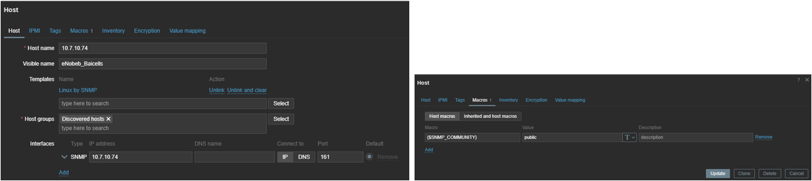
O template escolhido para a eNodeB foi o genético do linux por conter inúmeros OIDs padrão. Além disso, foi necessário criar itens de acordo com documentação disponibilizada na internet e correlacionar dados por meio de pesquisa com o utilitário snmpwalk para apontar os OIDs correspondentes com as informações de monitoramento solicitadas. A tabela 5 apresenta estas relações.

|DEMANDA|ITEM|
|--|--|
|Bits recebidos em todas as portas relevantes|OID:1.3.6.1.2.1.31.1.1.1.6.4|
|Bits enviados em todas as portas relevantes|OID: 1.3.6.1.2.1.31.1.1.1.10.4|
|Número de UEs conectadas|OID: 1.3.6.1.4.1.53058.100.11.1.0|
|Throughput no Uplink|OID:1.3.6.1.4.1.53058.190.7.1.0|
|Throughput no Downlink|OID:1.3.6.1.4.1.53058.190.8.1.0|
|Banda (bandClass)|OID:1.3.6.1.4.1.53058.100.6.0|
|Largura de banda|OID:1.3.6.1.4.1.53058.100.7.0|

Para atender os requisitos de monitoramento, todos os OIDs precisavam ser criados apontando as OIDs referentes a cada um dos dados. Além disso, foi preciso realizar a análise do tipo de dado recebido para calibragem da contagem. Um exemplo de como estes itens foram criados pode ser verificado na imagem 17.
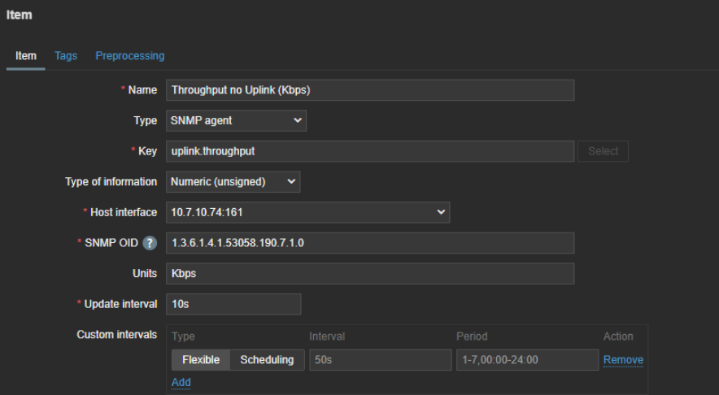
Com os itens completos a dashboard provisória pôde ser preparada conforme mostrado na imagem 18.
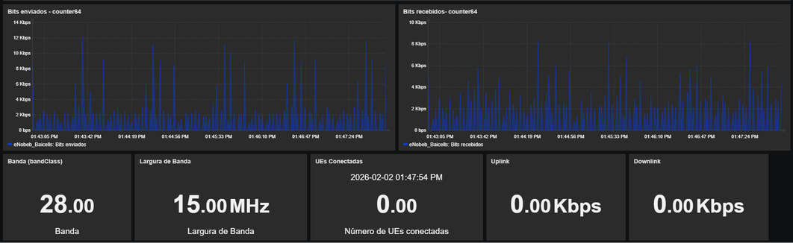

### Configurando Grafana via Agente
A forma de coleta de dados da máquina que vai receber o Grafana foi realizada via Zabbix Agent. Assim como a instalação do servidor, a documentação oficial fornece o passo a passo para a instalação do agente conforme o ambiente descrito. Os parâmetros passados pelo grupo podem ser observados na imagem 19.
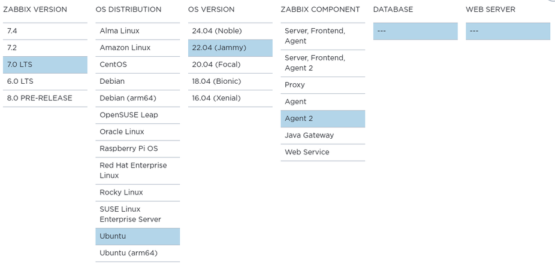

Os comandos fornecidos pela documentação oficial foram executados a partir do acesso ssh na máquina que receberia o grafana. A dinâmica de instalação aqui segue a mesma do servidor. O primeiro comando realiza o dowload do pacote .deb, em seguida se instala o pacote baixado no gerenciador de pacotes e por fim se realiza as atualizações. 
```
wget https://repo.zabbix.com/zabbix/7.0/ubuntu/pool/main/z/zabbix-release/zabbix-release_latest_7.0+ubuntu22.04_all.deb
dpkg -i zabbix-release_latest_7.0+ubuntu22.04_all.deb
apt update 
```
Depois disso basta realizar a instalação do agente e demais plugins usando o apt.
```
apt install zabbix-agent2
apt install zabbix-agent2-plugin-mongodb zabbix-agent2-plugin-mssql zabbix-agent2-plugin-postgresql 
```
O arquivo de configuração do agente precisa conter o ip de destino do servidor, bem como o hostname. Para isso é necessário editar o arquivo localizado na path sudo nano /etc/zabbix/zabbix_agentd.conf. No caso do ambiente em questão os parâmetros alterados ficaram da seguinte forma.
```
Server=10.7.101.205
ServerActive=10.7.101.205
Hostname=Grupo1-zabbix
```
Por fim é necessário reiniciar os serviços para atualizar as novas configurações
```
systemctl restart zabbix-agent2
```
Após seguir estes passos, o host estará pronto para ser incluído no zabbix e enviar informações via Agente. Este processo segue os mesmos passos dos elementos de rede anteriores, com diferença nos seguintes parâmetros.

**Host**
- Host name: 10.7.101.201
- Visible name: g1-grafana
- Templates: Linux by Zabbix Agent
- Host groups: Virtual machines
- Interfaces: Agent


Uma vez criados, os itens começarão a ser populados, sendo possível realizar o levantamento de quais serão usados para cumprir os pontos de monitoramento solicitados. A tabela 6 mostra este correlacionamento.

|DEMANDA|ITEM|
|--|--|
|Bits recebidos em todas as portas relevantes|Interface eth*: Bits received|
|Bits enviados em todas as portas relevantes|Interface eth*: Bits sent|
|Utilização de CPU|CPU Utilization|
|Utilização de memória|Available memory in %: Memory utilization|
|Quantidade de disco utilizado em porcentagem|FS [/]: Space Used, in%|

Todos os itens solicitados para o monitoramento deste elemento de rede estavam presentes no template incluído na criação do host, possibilitando a criação do seguinte gráfico provisório mostrado na imagem 21.

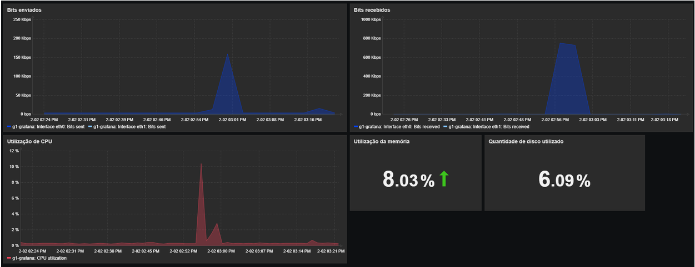

## Instalando e configurando o Grafana
Toda a documentação para instalação do Grafana no Ubuntu também é disponibilizada no site oficial. Sendo assim após realizar o acesso à máquina 10.7.101.201 via ssh basta executar os seguintes comandos. 
```
sudo apt-get install -y apt-transport-https wget
sudo mkdir -p /etc/apt/keyrings/
wget -q -O - https://apt.grafana.com/gpg.key | gpg --dearmor | sudo tee /etc/apt/keyrings/grafana.gpg > /dev/null
echo "deb [signed-by=/etc/apt/keyrings/grafana.gpg] https://apt.grafana.com stable main" | sudo tee -a /etc/apt/sources.list.d/grafana.list
echo "deb [signed-by=/etc/apt/keyrings/grafana.gpg] https://apt.grafana.com beta main" | sudo tee -a /etc/apt/sources.list.d/grafana.list
sudo apt-get update
sudo apt-get install grafana
sudo apt-get install grafana-enterprise
```
Conforme já abordado anteriormente durante a instalação do Zabbix a lógica de instalação para este utilitário é a mesma com algumas particularidades como criação de diretórios e importação de chave gpg.  Após a execução destes passos a interface de administração web pode ser acessada pelo navegador apontando o IP e a porta 3000. As credenciais padrões para primeiro acesso são admin/admin. Depois de se autenticar a página inicial se assemelha à imagem 22.
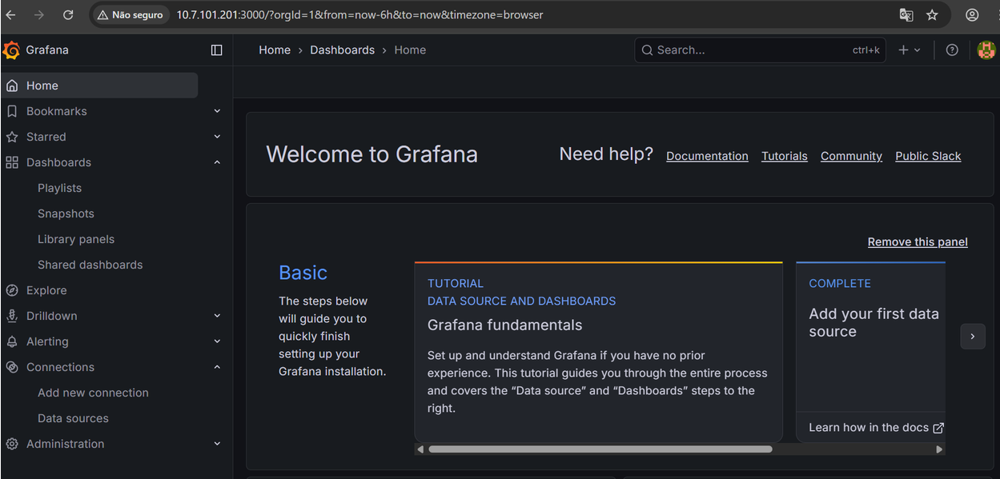
Para que o Grafana consiga consumir dados no Zabbix é preciso criar um usuário para o mesmo. Na interface web do zabbix isso pode ser feito acessando a aba Users, Users selecionando a opção create user no campo superior direito. Com o login e senha do usuário criado, de volta na interface de administração do Grafana a conexão deve ser feita na aba Connections, Data sources. No canto superior direito aparecerá a opção Add new data source. 

Dentre as opções deverá ser escolhido Zabbix. Os campos a serem preenchidos são basicamente as credenciais de login além da url no endpoint api_jsonrpc.php. A autenticação selecionada foi Basic authentication conforme pode ser visto na imagem 23. Depois de inserir as credenciais no fim da página deve-se salvar e testar a conexão. Se a conexão for bem sucedida você receberá um recado na cor verde indicando a versão do aplicativo. Isso indica que o grafana está recebendo dados e pronto para iniciar a criação dos dashboards com os mesmos.
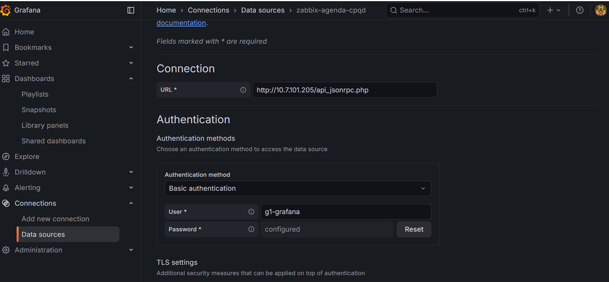

### Criando dashboards com o Grafana

O aplicativo em questão é muito intuitivo e se torna cada vez mais fácil operá-lo na medida em que você vai fazendo. Para obter uma melhor observabilidade dos parâmetros monitorados em cada elemento da rede, o grupo 1 optou primeiro por criar dashboards separadas. Essa abordagem facilitou a identificação dos pontos definidos como objetivos de monitoramento e possibilitou a análise de adição de outros pontos importantes a serem observados nos dispositivos.

Para criar uma nova dashboard basta acessar a aba Dashboards. No canto superior direito aparecerá a opção New. Ao clicar nesta opção haverá a opção New dashboard. Quando selecionada aparecerá o botão  Add visualization. Ao selecioná-lo o usuário deverá informar qual será o servidor de dados, neste caso o zabbix conectado no passo anterior.
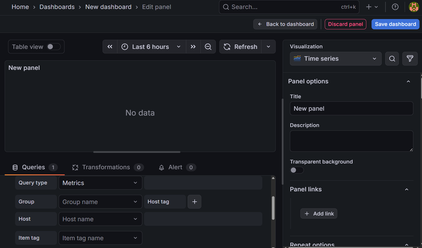
O painel de configuração de um gráfico, mostrado na imagem 24 solicita que seja informado o tipo de dado, o grupo do host, o host a tag do item e o item. No canto direito deve ser escolhido o tipo de visualização, ou como os dados vão se apresentar. Como os dados estão sendo puxados do zabbix, todas as informações de itens e hosts adicionados no momento anterior aparecerão dentre a opção. É possível agrupar os itens por tags e regex, ou adicionar novos itens para aparecer na mesma visualização. Os passos se repetem para a construção das dashboards de todos os elementos de rede mudando apenas os parâmetros conforme veremos nos próximos passos.

### Proxmox
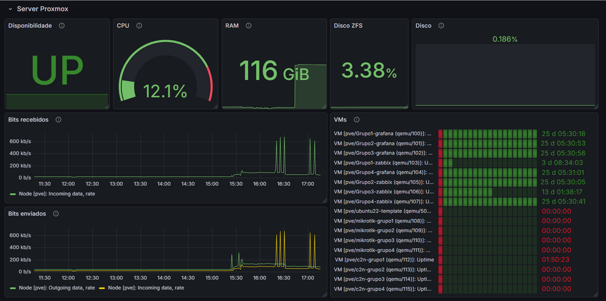
Os pontos exigidos na criação da dash para o monitoramento do servidor de virtualização Proxmox foram bits recebidos e enviados em todas as portas relevantes, utilização da CPU e memória RAM e quantidade utilizada de disco em porcentagem.  Os pontos adicionais foram a disponibilidade da API para entrega de dados e um painel de UpTime de máquinas virtuais.

#### Bits enviados e recebidos
A API do Proxmox já possui um item que filtra o tráfego pelo Node específico que estamos monitorando. Por isso, para criar um gráfico com tráfego duplo que pode ser visto no canto inferior direito da imagem 25 foi necessário somente apontar o item  em duas  querys preenchendo os campos com a seguinte forma.

**Visualization**: Time series
**Query A**
- Query type: Metrics
- Group: Hypervisors
- Host: Server_Proxmox
- Item tags: Null
- Item: Node [pve]: Outgoing data, rate

**Query B**
- Query type: Metrics
- Group: Hypervisors
- Host: Server_Proxmox
- Item tags: Null
- Item: Node [pve]: Ongoing data, rate

Para estes parâmetros não foram definidos Thresholds.

#### Utilização da CPU
Os dados de utilização da CPU também são fornecidos de forma já tratada em porcentagem, sendo necessário somente informar o item em uma query. Para ser exibido de forma similar ao apresentado na figura 25 aos campos devem ser preenchidos da seguinte forma.

**Visualization**: Gauge
**Query A**
- Query type: Metrics
- Group: Hypervisors
- Host: Server_Proxmox
- Item tags: Null
- Item: Node [pve]: CPU, usage

#### Utilização da RAM
Para trazer ao dashboard o valor em porcentagem já tratado foi necessário criar um item para este requisito. Como o template utilizado pela API do Zabbix oferece os dados de quantidade de RAM utilizada e total de RAM disponível, seguindo os passos de criação de item já abordados neste relatório foi necessário preencher os campos com as seguintes informações.

**Item**
- Name: Memory usage in %
- Type: Calculated
- Key: proxmox.node.mem.pcen[pve]
- Type of information: Numeric (float)
- Formula: last(//proxmox.node.memused[pve]) / last(//proxmox.node.memtotal[pve]) * 100
- Units: %
- Update interval: 30s

Com o item pronto e calculando os valores corretamente, de volta no grafana foi necessário somente apontar o host na query da seguinte forma.

**Visualization**: Gauge

**Query A**
- Query type: Metrics
- Group: Hypervisors
- Host: Server_Proxmox
- Item tags: Null
- Item: Memory usage in %

Os Thresholds para este gráfico foram definidas de forma padrão como limites de alarme para 70% e 90%.

#### Uso de Disco em porcentagem
Assim como o uso de memória RAM em porcentagem, o uso de disco também precisou ser calculado no Zabbix antes de ser especificado no grafana. Os parâmetros para criação do item foram os seguintes.

**Item**
- Name: Uso em porcentagem ZFS
- Type: Calculated
- Key: stored.pused.zfs
- Type of information: Numeric (float)
- Formula: last(//proxmox.node.disk[pve, local-zfs]) / last(//proxmox.node.maxdisk[pve,local-zfs]) * 100
- Units: %
- Update interval: 10s

De volta no grafana os parâmetros para plotagem dos valores recebidos foram os seguintes.

**Visualization**: Bar gauge

**Query A**
- Query type: Metrics
- Group: Hypervisors
- Host: Server_Proxmox
- Item tags: Null
- Item: Uso em porcentagem ZFS

Os Thresholds para este gráfico foram definidas de forma padrão como como limites de alarme para 70% e 90%.

#### Disponibilidade da API
No template da API proxmox existe um item pronto que verifica a disponibilidade do serviço. Esse parâmetro foi escolhido pelo grupo para verificar se o serviço está ativo e se os dados estão sendo coletados corretamente. Como o item já existe, foi necessário somente criar o gráfico na grafana com os seguintes parâmetros.

**Visualization**: Bar gauge

**Query A**
- Query type: Metrics
- Group: Hypervisors
- Host: Server_Proxmox
- Item tags: Null
- Item: API services status

Para mapear os valores recebidos aqui foram configurados mapas de valores sendo 0 como DOWN e 1 como OK conforme especificado na descrição do próprio item utilizado.

#### UpTime de Ambiente virtualizado
O template utilizado para este elemento de rede cria um item para cada máquina existente no servidor e mede seu tempo de atividade. Sendo assim, para criar o painel foi utilizado regex chamando todas as tags que contêm o termo uptime e todos os itens que contém o termo qemu. Parâmetros são passados para isso forma o seguinte.

**Visualization**: Bar gauge

**Query A**
- Query type: Metrics
- Group: Hypervisors
- Host: Server_Proxmox
- Item tags: /qemu/
- Item: /Uptime/

O alarme de alteração foi definido com mapa de valor sendo de 0s - 86400s vermelho (requer atenção) e acima de 86400s verde (ok). Num ambiente virtualizado é preciso verificar novos endpoints e ser avisado quando um já existente sofreu uma reinicialização destacando esses eventos ao analista responsável.

### pfSense
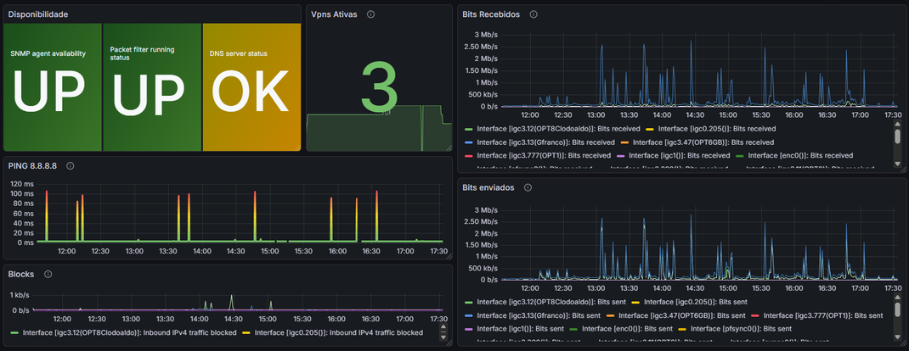
Os pontos mínimos exigidos para o monitoramento do firewall pfSense foram os bits recebidos e enviados nas interfaces relevantes e número de usuários de OpenVPN conectados. Sendo assim, além destes gráficos, o grupo ainda incluiu no monitoramento deste elemento a disponibilidade do host via ICMP ping, o funcionamento do DNS, a disponibilidade do filtro de pacotes, número de bloqueios realizados pela regra definida e ping para internet.

#### Bits enviados e recebidos nas interfaces relevantes
Os templates incluídos no zabbix para o pfSense possuem itens que monitoram interface por interface, sendo assim foram tomadas como relevantes para o grupo somente interfaces com tags de VLAN. Para plotar a informação conjunta foi criado primeiro um item de soma na zabbix usando como base o tag e o caractere coringa *. Os parâmetros usados para isso podem ser vistos a seguir.

**Item**
- Name: Tráfego Total enviado (Soma)
- Type: Calculated
- Key: net.if.out.total
- Type of information: Numeric (unsigned)
- Formula: sum(last_foreach(//net.if.out[*]))
- Units: bps
- Update interval: 5s

**Item**
- Name: Tráfego Total recebido (Soma)
- Type: Calculated
- Key: net.if.in.total
- Type of information: Numeric (unsigned)
- Formula: sum(last_foreach(//net.if.in[*]))
- Units: bps
- Update interval: 5s

Com agrupamento criado no zabbix, na grafana foi necessário somente apontar este objeto. Dessa forma o gráfico para os bits de entrada e saída foram definidos assim.

**Visualization**: Time series

**Query A**
- Query type: Metrics
- Group: Applications
- Host: FW1_PFSENSE
- Item tags: Null
- Item: Tráfego Total enviado

**Query B**
- Query type: Metrics
- Group: Applications
- Host: FW1_PFSENSE
- Item tags: Null
- Item: Tráfego Total recebido

Para estes parâmetros não foram definidos Thresholds

#### Número de usuários OpenVPN
Para obter o número de usuários foi necessário realizar os procedimentos já detalhados neste relatório, criando desta forma um item que produz dados tratados para a plotagem no grafana. Sendo assim a criação do gráfico contemplou os seguintes parâmetros.

**Visualization**: Stat
**Query A**
- Query type: Metrics
- Group: Applications
- Host: FW1_PFSENSE
- Item tags: Null
- Item: OpenVPN: Total de Usuários

Para estes parâmetros não foram definidos Thresholds

#### Disponibilidade ICMP, Packet filter e DNS
Os status de disponibilidade também são provenientes de itens já existentes nos templates inclusos no Zabbix. Sendo assim foi necessário criar um gráfico de interpretação conforme os valores recuperados com os parâmetros abaixo.

**Visualization**: Stat

**Query A**
- Query type: Metrics
- Group: Applications
- Host: FW1_PFSENSE
- Item tags: Null
- Item: SNMP agent availability

**Query B**
- Query type: Metrics
- Group: Applications
- Host: FW1_PFSENSE
- Item tags: Null
- Item: Packet filter running status

**Query C**
- Query type: Metrics
- Group: Applications
- Host: FW1_PFSENSE
- Item tags: Null
- Item: DNS server status

Os alarmes para estes elementos foram definidos através de mapas de valores de acordo com descrição de cada item para UP e DOWN.

#### Ping 8.8.8.8
Para verificar a latência e conectividade com a rede pública, o grupo precisou criar um item que executasse um ping do pfSense para a internet e recuperar as informações da resposta, medindo assim a conectividade e o tempo de resposta. Para isso no painel de administração do pfSense, na aba Services, no Zabbix Agent7, dentro das Opções Avançadas foi inserido o seguinte comando.
```
UserParameter=pfsense.setates.count,/sbin/pfctl -si | grep “current entries” | awk ‘{print $3}’
```
Em seguida foi necessário criar o item no Zabbix, responsável por acionar esse comando. Seguindo os passos já explicados neste relatório, o item criado no host do pfsense recebeu as seguintes informações.

**Item**
- Name: ping
- Type: Zabbix agent
- Key: custom.ping.google
- Type of information: Numeric (float)
- Host interface: 177.125.143.130:10050
- Units: ms
- Update interval: 30s

Para visualizar no grafana o resultado no grafana o gráfico criado recebeu os seguintes parâmetros.

**Visualization**: Time series

**Query A**
- Query type: Metrics
- Group: Applications
- Host: FW1_PFSENSE
- Item tags: Null
- Item: ping

Para estes parâmetros não foram definidos Thresholds.

#### Tráfego bloqueado
O template do pfSense no zabbix já possui o item que recupera o tráfego bloqueado em cada uma das interfaces. Para apresentar o bloqueio em todas as interfaces o gráfico foi configurado via regex com as seguintes informações.

**Visualization**: Time series

**Query A**
- Query type: Metrics
- Group: Applications
- Host: FW1_PFSENSE
- Item tags: Null
- Item: /traffic blocked/

Para estes parâmetros não foram definidos Thresholds.

### Switch PICA8
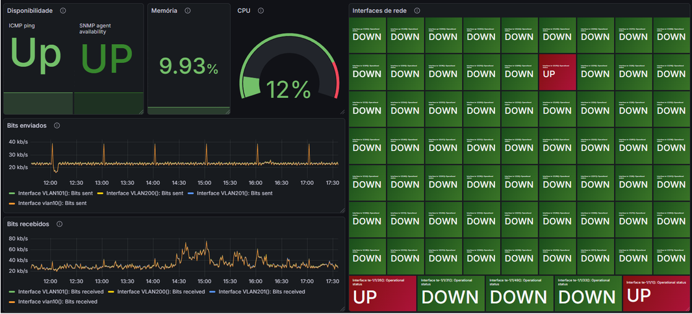

Os requisitos obrigatórios para monitoramento do switch foram bits recebidos e enviados em interfaces relevantes, utilização de CPU e memória RAM. Além disso, o grupo definiu como pontos extras a disponibilidade do ICMP ping, do agente SNMP e quadro de monitoramento de interfaces ativas e inativas.

#### Bits enviado e recebidos
A lógica para calcular os bits recebidos e enviados em interfaces relevantes do switch foi parecida com a do item criado na sessão anterior. Como o template utilizado já recuperava os dados de cada interface, foram selecionadas as interfaces ativas e somadas em um único item. Em seguida no grafana este item foi apontado para ser plotado no gráfico da seguinte forma.

**Visualization**: Time series

**Query A**
- Query type: Metrics
- Group: PICA8
- Host: SWITCH_PICA8
- Item tags: Null
- Item: Tráfego Total enviado

**Query B**
- Query type: Metrics
- Group: PICA8
- Host: SWITCH_PICA8
- Item tags: Null
- Item: Tráfego Total recebido

#### Uso de CPU e RAM
O uso de CPU e RAM do switch também não era recuperado de forma tratada em porcentagem. Para conseguir o valor correto foi realizada a mesma abordagem já explicada anteriormente. Ou seja, criando itens para dividir o valor de uso com o total e multiplicando por 100. Sendo assim, as configurações para uso de CPU no grafana ficaram da seguinte forma.

**Visualization**: Stat
**Query A**
- Query type: Metrics
- Group: PICA8
- Host: SWITCH_PICA8
- Item tags: Null
- Item: Porcentagem de Uso de CPU

Enquanto para o uso de memória RAM ficou assim

**Visualization**: Stat
**Query A**
- Query type: Metrics
- Group: PICA8
- Host: SWITCH_PICA8
- Item tags: Null
- Item: Porcentagem de Uso de CPU

Os thresholds para estes elementos foram deixados como padrão de alerta em 70% e risco 90%.

#### Disponibilidade ICMP e SNMP
Os dados de disponibilidade foram obtidos via itens padrão já definidos pelo template utilizado, sendo necessário no grafana somente alterar o mapa de valores para interpretar as flags 1 e 0 para Up e Down. Desta forma as configurações foram realizadas da seguinte forma.

**Visualization**: Stat

**Query A**
- Query type: Metrics
- Group: PICA8
- Host: SWITCH_PICA8
- Item tags: Null
- Item: ICMP ping

**Query B**
- Query type: Metrics
- Group: PICA8
- Host: SWITCH_PICA8
- Item tags: Null
- Item: SNMP agent availability

#### Quadro de portas ativas
O quadro de portas ativas foi criado através de regex para agrupar o item Operational Status das interfaces te e qe. Os valores obtidos pelo template do zabbix também são 0 e 1. Para tornar mais amigável ao analista foram alterados os mapas de valor para 0 e 1. Aqui as cores foram invertidas sinalizando que interfaces ativas requerem atenção, pois sofrerão acesso físico. Por fim, os parâmetros para criar o quadro foram os seguintes.

**Visualization**: Stat

**Query A**
- Query type: Metrics
- Group: PICA8
- Host: SWITCH_PICA8
- Item tags: /interface: qe-/
- Item: /Operational status/

**Query B**
- Query type: Metrics
- Group: PICA8
- Host: SWITCH_PICA8
- Item tags: /interface: te-/
- Item: /Operational status/

### Baicells

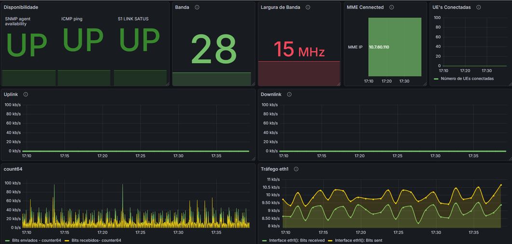
Os pontos obrigatórios definidos para a eNodeB foram bits enviados e recebidos em interfaces relevantes, número de UE`s conectadas, throughput de downlink e uplink, banda e largura de banda. Além destes pontos, o grupo definiu como pontos importantes a serem monitorados a disponibilidade do SNMP, ICMP o status do link S1 e o IP de conexão da MME.

#### Bits recebidos e enviados
Depois de encontrar a OID correta através do snmpwalk e realizando algumas pesquisas de documentação, a plotagem dos bits enviados e recebidos se baseou somente em apontar o item criado para esta finalidade. Sendo os parâmetros os seguintes.

**Visualization**: Time series

**Query A**
- Query type: Metrics
- Group: Discovered hosts
- Host: eNodeb_Baicells
- Item tags: interface: eth1
- Item: Interface eth1(): Bits received

**Query B**
- Query type: Metrics
- Group: Discovered hosts
- Host: eNodeB_Baicells
- Item tags: interface: eth1
- Item: Interface eth1(): Bits sent

Para estes parâmetros não foram definidos Thresholds

#### Throughput de downlink e uplink
Os dados expressos de throughout de downlink e uplink também foram obtidos via Item criado a partir da obtenção de informação da OID. Para plotá-los no gráfico foi necessário somente indicar o item criado.

**Visualization**: Time series

**Query A**
- Query type: Metrics
- Group: Discovered hosts
- Host: eNodeb_Baicells
- Item tags: null
- Item: Throughput no Uplink (kbps)

**Query B**
- Query type: Metrics
- Group: Discovered hosts
- Host: eNodeB_Baicells
- Item tags: null
- Item: Throughput no Downlink (kbps)

Para estes parâmetros não foram definidos Thresholds

#### Banda e largura de banda
A banda e largura de banda são valores estáticos, o primeiro foi possível obter somente identificando a OID responsável por ele, sendo configurado no gráfico da seguinte forma.

**Visualization**: Stat

**Query A**
- Query type: Metrics
- Group: Discovered hosts
- Host: eNodeb_Baicells
- Item tags: null
- Item: Banda

Já para obter o valor correto da largura de banda foi necessário aplicar um pré-processamento no valor obtido. Isso foi feito diretamente no Zabbix após consulta e documentação da MIB fornecida pelo fabricante que indica a informação dos dados brutos, sendo necessário dividir o valor por 5 para chegar no valor real. 

**Visualization**: Stat

**Query A**
- Query type: Metrics
- Group: Discovered hosts
- Host: eNodeb_Baicells
- Item tags: null
- Item: Largura de Banda

#### Disponibilidade SNMP, ICMP e S1 Link Status
Assim como em todos os elementos de disponibilidade, os valores obtidos pelas OIDs variam entre 0 e 1, sendo necessário somente o tratamento dos dados por meio do mapa de valores do Grafana. Sendo 1 para UP e 0 para DOWN, as informações para a plotagem do gráfico foram as seguintes.

**Visualization**: Stat

**Query A**
- Query type: Metrics
- Group: Discovered hosts
- Host: eNodeb_Baicells
- Item tags: null
- Item: SNMP agent availability

**Query B**
- Query type: Metrics
- Group: Discovered hosts
- Host: eNodeB_Baicells
- Item tags: null
- Item: ICMP ping

**Query C**
- Query type: Metrics
- Group: Discovered hosts
- Host: eNodeB_Baicells
- Item tags: null
- Item: S1 LINK STATUS

#### Conexão MME
Durante as pesquisas da MIB o grupo identificou a possibilidade de trazer para a dashboard o IP no qual a eNodeB está conectada. Utilizando está OID e com mapa de valores foi criado um gráfico onde sempre que um valor novo aparecer ele deve aparecer como vermelho para alerta, enquanto o valor já configurado estará sempre verde até que os analistas o alterem.

**Visualization**: State timeline

**Query A**
- Query type: Text
- Group: Discovered hosts
- Host: eNodeb_Baicells
- Item tags: null
- Item: MME IP

#### UEs conectadas
O número de UEs conectadas também é um valor numérico passado por uma OID específica da MIB do fabricante. Após identificada, foi necessário somente criar o item e apontá-lo no Grafana.

**Visualization**: Stat

**Query A**
- Query type: Text
- Group: Discovered hosts
- Host: eNodeb_Baicells
- Item tags: null
- Item: Número de UEs conectadas

### Grafana
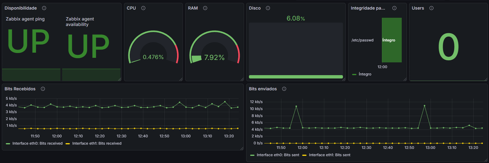
Por fim, os pontos obrigatórios para monitoramento da VM onde o Grafana foi instalado foram definidos como bits enviados e recebidos, utilização de CPU, memória RAM e quantidade de disco utilizada em porcentagem. Além disso, o grupo definiu como relevante identificar o número de usuários logados na máquina, a integridade do arquivo /etc/passwd e a disponibilidade ICMP e de agente do Zabbix.

#### Bits recebidos e enviados
Conforme verificado, a única interface ativa na máquina era a eth0, por isso no gráfico de monitoramento do tráfego foi definido como item somente os correspondentes a esta. Sendo assim as seguintes configurações.

**Visualization**: Time series

**Query A**
- Query type: Metrics
- Group: Virtual machines
- Host: g1-grafana
- Item tags: null
- Item: Interface eth0: Bits received 

**Query B**
- Query type: Metrics
- Group: Virtual machines
- Host: g1-grafana
- Item tags: null
- Item: Interface eth0: Bits sent

Para estes parâmetros não foram definidos Thresholds

#### Uso de CPU e memória RAM
O template utilizado para este elemento de rede foi o Linux Basic que por padrão já oferece inúmeros itens já tratados. Um exemplo é tanto a utilização de CPU quanto a utilização de Memória que foram recuperados de forma já normalizada, bastando indicar o item no gráfico criado da seguinte forma.

**Visualization**: Gauge

**Query A**
- Query type: Metrics
- Group: Virtual machines
- Host: g1-grafana
- Item tags: null
- Item: CPU Utilization 

**Query B**
- Query type: Metrics
- Group: Virtual machines
- Host: g1-grafana
- Item tags: null
- Item: Memory utilization

#### Disponibilidade ICMP e Agent
Assim como em quase todos os gráficos de disponibilidade, a obtenção de informações via agente na máquina do grafana não foi diferente. O valor obtido varia entre 0 e 1 e foi traduzido via mapa de valor para DOWN e UP. 

**Visualization**: Stat

**Query A**
- Query type: Metrics
- Group: Virtual machines
- Host: g1-grafana
- Item tags: null
- Item: Zabbix agent ping

**Query B**
- Query type: Metrics
- Group: Virtual machines
- Host: g1-grafana
- Item tags: null
- Item: Zabbix agent availability

#### Uso de disco em porcentagem
O uso de disco em porcentagem também foi obtido através de um item pronto facilitando o trabalho da equipe. Os thresholds para este elemento foram mantidos da forma clássica como 70% em alerta e 90% como risco.  

**Visualization**: Bar gauge

**Query A**
- Query type: Metrics
- Group: Virtual machines
- Host: g1-grafana
- Item tags: null
- Item: FS [/]: Space: Used, in %

#### Integridade do passwd e usuários logados
O monitoramento destes dois pontos foi identificado por análise de itens disponíveis e classificados pela equipe como pontos importantes a serem monitorados. Como a integridade de passwd retorna uma hash, seu alerta foi configurado para a mudança para qualquer valor diferente do configurado no mapa de valor.

**Visualization**: State timeline

**Query A**
- Query type: Metrics
- Group: Virtual machines
- Host: g1-grafana
- Item tags: null
- Item: Checksum of /etc/passwd

Já a contabilidade do número de usuários traz quantidade de usuários é feita por meio de números inteiros. O sistema identifica somente usuários logados no sistema operacional, ignorando usuários logados na plataforma de administração do grafana, sendo este um ponto a ser melhorado numa próxima entrega.

**Visualization**: Stat

**Query A**
- Query type: Metrics
- Group: Virtual machines
- Host: g1-grafana
- Item tags: null
- Item: Number of logged in users

## Dashboard Final
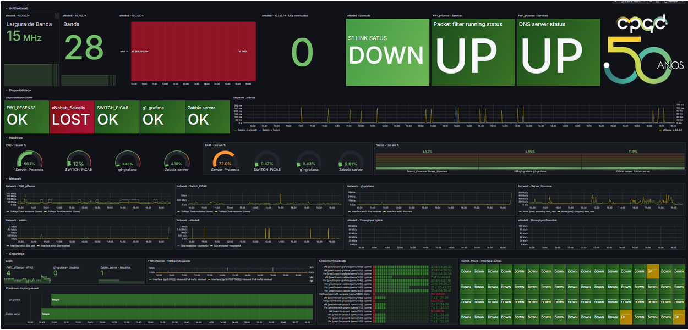
Tendo todos os pontos de monitoramento identificados e preparados é hora de definir a apresentação da dashboard. Antes de começar é preciso ter em mente que uma dashboard deve ser intuitiva e de fácil interpretação para os analistas. Sendo assim, para ter uma visão completa da rede em tempo real, foi de entendimento do grupo que a mesma deve ser completamente apresentada em uma só tela. 

Além da disposição dos itens, foram criadas abas separadas por natureza do gráfico de forma similar a indexação de tags do Zabbix. Sendo assim foram separados setores de Informação, Disponibilidade, Hardware, Network e Segurança. Esta divisão facilita o entendimento das searas de forma separada sem deixar de permitir a compreensão do funcionamento da rede como um todo. 

Para criar uma nova aba, depois de iniciar a criação da dashboard, é necessário selecionar o botão Edit, em seguida ao clicar no botão Add é necessário prosseguir para a opção Row. Isso criará uma aba sem nome que pode ser editada clicando no ícone de engrenagem.  

### INFO
Na aba info foram plotados gráficos em sua maioria estáticos que fornecem informações sobre a rede monitorada. Sendo assim foram destacados para esta seara as informações de Banda, Largura de Banda, Ip do MME, Número de UEs conectadas, Status da interface S1.

### Disponibilidade
Na aba de disponibilidade foram definidos parâmetros que medem a atividade dos hosts da rede. Em sua maioria são dados booleanos que retornam 1 ou 0 interpretados para UP e DOWN. Além disso, foi criado um gráfico de latência que usa o protocolo icmp ping para medir a demora na resposta em hosts da rede.

### Hardware
A aba de hardware ficou responsável por expressar os dados de saúde dos dispositivos de rede como uso de RAM, CPU e Discos. Grande partes destes dados precisaram ser tratados para retornarem os valores em porcentagem conforme já abordamos no relatório. 

### Network 
Conforme o nome da própria aba, este setor foi designado para especificar o tráfego das interfaces dos dispositivos na rede. Em cada gráfico foi colocado tanto o uplink quanto o downlink de forma unificada quando mais de uma interface relevante. 

### Security
Na aba security se concentrou a maioria dos gráficos extras definidos pelo grupo como portas ativas do switch, ambiente virtualizado, integridade de arquivos e número de usuários logados tanto na VPN quanto nos sistemas operacionais.

